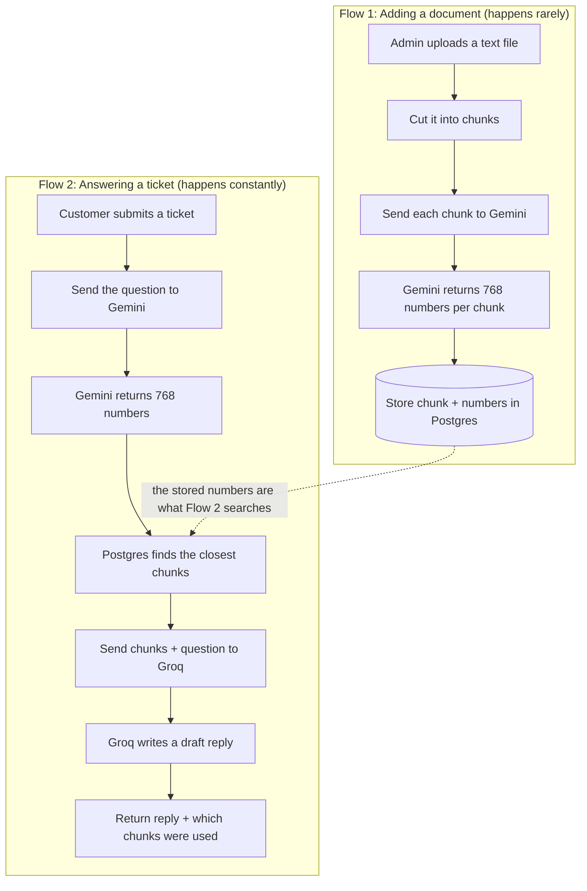
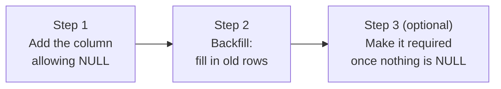
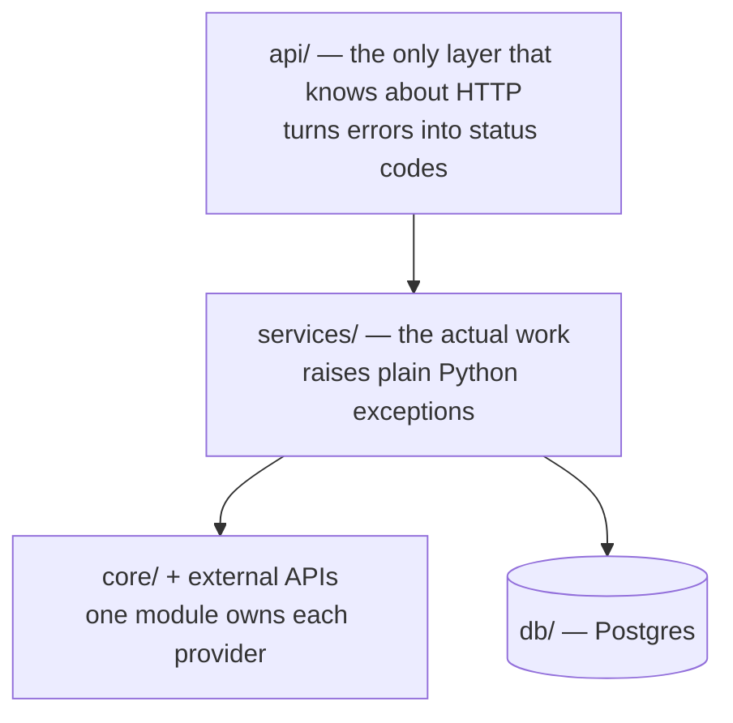

# Day 3 — What I Learned: RAG, Embeddings and Hallucination

Written in plain language, for future me.

---

## 1. The problem we are solving

A customer writes in with a question. Somewhere in the company's
documentation, the answer exists. We want a computer to find it and draft
a reply.

The obvious idea — "give the AI all our documentation and let it answer" —
does not work. Two reasons:

**It does not fit.** A model can only read a limited amount of text at once.
This limit is called the **context window**. A company's full documentation
is far too big.

**It costs money every time.** You pay per word sent. Sending an entire
manual to answer "what's your refund policy?" is like posting someone an
encyclopedia because they asked what time it is.

So instead: find the two or three paragraphs most likely to contain the
answer, and send only those. Finding those paragraphs is the hard part, and
that is what today was about.

The whole approach has a name: **RAG — Retrieval Augmented Generation.**
Retrieve the right text, then generate an answer using it.

---

## 2. The two flows I built



The key insight: **both flows turn text into the same kind of numbers.**
That is the only reason a question can be compared to a document.

---

## 3. Embeddings — the core idea

### The problem with searching for words

A customer writes: *"my card got declined"*

The documentation says: *"payment authorisation failure"*

Not a single word in common. Word-matching finds nothing. But any human
knows these are the same thing.

### The solution: turn meaning into coordinates

An **embedding** is a list of numbers that represents the *meaning* of a
piece of text.

Think of a map. On a map, two numbers (latitude and longitude) place a city.
Cities near each other have similar numbers.

An embedding does the same thing for meaning, except with 768 numbers
instead of 2. Text about similar things gets similar numbers.

```
      A made-up 2D version of what really happens in 768 dimensions

      ^
      |                                    * "how do I get my money back"
      |                          * "refund policy"
      |                   * "billing and payments"
      |
      |        * "account locked"
      |   * "password reset"
      |
      |                                             * "how to cook rice"
      +--------------------------------------------------------->

      Things that MEAN similar things end up NEAR each other,
      even when they share no words at all.
```

We do not write this map. Google's model learned it from enormous amounts
of text. We just send text and get coordinates back.

### Two things I must not forget

**1. Different models make different maps.** An embedding from Gemini
cannot be compared to one from another model. They are different
coordinate systems entirely. If I ever switch models, every chunk in the
database has to be redone.

**2. Embeddings understand meaning, not exact spelling.** "BIL-402" carries
almost no meaning, so it does not embed well. This is a real weakness, and
Day 8 fixes it by adding word-matching alongside meaning-matching.

---

## 4. Measuring "close" — cosine similarity

Once the question and the chunks are both points on the map, "which chunk
is relevant?" becomes "which point is nearest?"

**Cosine similarity** measures the *angle* between two points as seen from
the origin, not the straight-line gap. It asks: are these pointing the same
direction?

Why the angle and not the distance? Because a long chunk and a short chunk
about the same topic should count as similar. Length would otherwise make
them look far apart.

### The flip that will bite me

Postgres does not give me similarity. It gives me **distance**:

```
    distance = 1 - similarity

    DISTANCE (what Postgres returns)
    0.0 -------------------------------- 1.0
    identical                        unrelated
    SMALL is BETTER

    SIMILARITY (what humans think in)
    0.0 -------------------------------- 1.0
    unrelated                       identical
    BIG is BETTER
```

So my code sorts by distance (smallest first) but reports similarity
(`1 - distance`).

**If I get this backwards, nothing crashes.** The system just quietly
returns the *least* relevant chunk every single time. That is the worst
kind of bug: silent and wrong.

---

## 5. Chunking, and why chunks overlap

We cut documents into pieces of about 500 tokens each. But the pieces
overlap by 50 tokens.

```
    The document as one long line of tokens:

    0        450     500        950   1000       1450  1500
    |---------|-------|----------|-----|----------|-----|
    [======= chunk 1 =======]
                  [======= chunk 2 =======]
                                 [======= chunk 3 =======]
                  ^^^^^^^                ^^^^^^^
                  overlap                overlap
                  (appears in both)
```

### Why deliberately repeat text?

Imagine the policy says:

> Refunds are issued within 14 days. **This does not apply to digital goods.**

If the cut lands between those two sentences, chunk 1 says "refunds in 14
days" — full stop, exception gone. A customer asks about a digital refund,
that chunk is retrieved, and the system gives a confidently wrong answer.

Not because the model lied. Because the sentence that mattered was in a
different chunk.

Overlap means a sentence sitting on a boundary appears **whole** in at least
one chunk. It costs about 10% extra storage. Cheap insurance.

### The tradeoff

| | Good | Bad |
|---|---|---|
| **Small chunks** | Precise, focused | Might cut a rule away from its exception |
| **Large chunks** | Keeps context together | The useful sentence gets diluted; costs more |

500/50 is a reasonable default, not a proven number. Day 7 tests it properly.

---

## 6. Why a normal database index does not work

A normal database index is built for questions like "find the row where
id = 5" or "find rows where price > 100". It sorts things in order.

But there is no sensible way to put 768-dimensional points in order. "Which
of these is bigger?" has no meaning when each thing is 768 numbers.

### The naive way

Compare the question against every single chunk, then sort by closeness.
Perfectly accurate. Fine for my 3 chunks. Hopeless for 10 million.

### HNSW

**HNSW** builds a web of connections between nearby points. Searching walks
the web, hopping towards the target, and only looks at a tiny fraction of
the data.

```
    Without an index:              With HNSW:

    check every point              start somewhere, hop closer
    * * * * * * * * *              *          *
    * * * * * * * * *                 \
    * * * * * * * * *                  * ---> * ---> [target]
    * * * * * * * * *                              /
    * * * * * * * * *              *          * --
    (all of them)                  (a handful of them)
```

The catch is in the name: **approximate**. It can occasionally miss the true
best match. That is a deliberate trade — a small amount of accuracy for an
enormous amount of speed.

### The trap I set for myself

When I built the index I told it to organise around **cosine** distance.

**The index only gets used if my query also uses cosine.** If I ever query
with a different distance measure, Postgres silently ignores the index and
checks every row. No error. Just slow.

### Something that looked like a bug and was not

With only 3 rows, Postgres ignores my index and scans everything anyway.
That is correct behaviour — with 3 rows a scan is genuinely faster than
consulting an index. It will start using the index when the data grows.

---

## 7. Adding a column to a table that already has data

The `chunks` table already had rows when I added the `embedding` column.
Those rows had no vector and there is no sensible value to invent — a row
of zeros would be a lie that quietly poisons every search result.

So the column is **nullable**. NULL means "nothing here yet", which is the
truth.



This three-step pattern is what real teams do, because you cannot take a
database offline to change its shape. It works because each step alone is
safe.

### One-off scripts must be safe to re-run

My backfill script only touches rows where the embedding is NULL. That
makes it **idempotent** — running it ten times does the same thing as
running it once.

Why that matters: if the script dies halfway through 5,000 rows, I just run
it again and it picks up where it stopped. Without the NULL filter, a
restart would redo work already done and waste API quota.

---

## 8. The hallucination — the most important thing I learned

### Why models make things up

A language model does exactly one thing: given the text so far, guess the
next word. Then the next. Then the next.

It is not looking anything up. There is no database inside it. It has no
sense of "I know this" versus "I am guessing".

It produces the most **plausible-sounding** continuation, always. Sometimes
plausible is also true. When it is not, the output looks and sounds
identical.

**Fluent and true are two separate things, and the model only aims for the
first.**

This is why "hallucination" is **structural**, not a bug that gets fixed in
the next version. It is what the machine does.

### What I actually saw

I asked my system: *"Do you offer a student discount, and how do I apply
for it?"*

My documents say nothing about student discounts.

With a lazy instruction — "you are a helpful support assistant" — it replied:

> I'm afraid we don't have a dedicated student discount at the moment. All of
> our plans are priced as listed (Starter $12/month, Team $49/month, Business
> $199/month) with the 20% annual-billing discount available on the Team and
> Business tiers.
>
> If you believe you might qualify for a special rate or have a unique
> situation, you can reach out to our billing team at billing@example.com.
> They'll review your request and let you know if any additional discounts
> can be applied.

### Why this is worse than an obvious lie

Every price is correct. The annual discount is correct. The email address is
real.

**The invented part is the process.** My documents say that email is for
refund requests with an invoice number. There is no discount review. It does
not exist. The model made it up because helpful support replies *end* with a
next step, so it wrote one.

It also said "at the moment" — implying it knows about future plans.

A reviewer skims this, sees correct prices and a real email, and approves it.
The customer emails about a review process that does not exist. Now a real
support agent has to explain that their own system was wrong.

**Production hallucination usually looks like this: mostly true, fluent, with
something invented quietly attached.** Not a made-up number you would catch
in two seconds.

### The fix

I replaced the instruction with a strict one: answer only from the provided
text, say exactly "The documentation does not cover this" when it is not
there, then stop, and never invent emails, prices, timeframes or processes.

Same question. Same retrieved chunks. Same model. New answer:

> The documentation does not cover this.

### Checking I did not break the good cases

A prompt so strict that it refuses everything is useless. So I tested three
kinds of question:

| Question type | Result |
|---|---|
| Fully answerable | Gave the correct 14-day answer |
| Not answerable | The exact refusal sentence |
| Half answerable | Gave the part it knew, said the rest is not covered |

The half-answerable one is the impressive case: it gave me error code
BIL-409 for an expired card, then said updating card details is not covered.
It did not invent a Settings menu path.

### Being honest about what this is

The instruction is **tokens in a prompt, not a rule the machine obeys.** It
reduces hallucination a lot. It does not eliminate it.

Proof from my own testing: a later ticket said *"I signed up last week"* and
the model replied *"since you signed up last week, you are still within that
window."* But my document counts 14 days **from the first charge**, not from
signup. Those are different events. Every fact it stated was correct — it
just reasoned past the text and made an eligibility decision the document
does not support.

That is why the design needs three defences, not one:

1. **Grounding** — the strict instruction
2. **Citations** — every draft shows which chunks it came from
3. **A human** — nothing goes to a customer without review

---

## 9. The measurement that surprised me most

I tested 10 questions in three groups and recorded the top score for each.

```
    0.50        0.55        0.60        0.65
      |-----------|-----------|-----------|

      [UNRELATED]
      0.515 - 0.525
      "how to cook rice", "who won the football"

                  [NOT IN MY DOCUMENTS]
                  0.586 --- 0.605
                  "student discount?", "phone number?"

                 [ANSWERABLE FROM MY DOCUMENTS]
                 0.587 ----------------- 0.656
                 "refund window?", "card declined?"

                  ^^^^^^^^^^^^^^^^
                  THESE TWO OVERLAP
```

### What this means

My **worst real question** — "How long does delivery to the UK take?" at
0.5865 — scored **lower** than two questions my documents cannot answer.

A single word, "please", scored 0.6093.

**There is no cut-off number that lets in every good question and blocks
every bad one.** Set it at 0.60 and I reject a real delivery question. Set
it at 0.58 and the student discount gets through.

### Why this happens

"Do you offer a student discount?" genuinely *is* a billing question. The
embedding is correctly telling me the topic matches.

**Similarity measures whether the topic matches. It cannot tell me whether a
specific fact is inside the text.** Those are different questions, and only
one of them is answerable by measuring distance.

### So what is my 0.55 cut-off actually for?

Junk. It reliably blocks "how to cook rice", which sits cleanly at 0.52.
That is all it does, and that is all I should claim for it.

The overlap problem is handled by the grounded prompt and the human
reviewer, not by a number.

**This is the single most useful thing I learned today.** Most explanations
of RAG imply a threshold solves grounding. My own measurements say it
cannot.

---

## 10. How the code is arranged



### One module owns each outside service

Only `embeddings.py` knows about Gemini. Only `llm.py` knows about Groq.
Nothing else imports them or knows their URLs.

Why: when I switch provider — and I did have to switch the Groq model
today, because the one I picked was retired — the change is one file.

### Services do not know they are on the web

`services/` raises its own errors like `EmbeddingError` and `LLMError`.
It has never heard of HTTP status codes. Only `api/` translates them.

Why this matters practically: I tested every service today by running a
plain Python script, with no web server running at all. That is only
possible because they are not tangled together.

---

## 11. Small things that cost me time

| What happened | Why | Lesson |
|---|---|---|
| Vectors were not length 1.0 | Google normalises its full-size output, not the shrunk version | Measure, do not assume. I checked instead of trusting a blog post |
| Auto-generated migration would not run | Alembic saw the column but wrote a broken import, and cannot see extensions or vector indexes at all | Autogenerate is a **draft**. Always read it before applying |
| Container crashed: no module named httpx | It was declared as a test-only dependency | If the app imports it, it is a real dependency |
| Groq returned 404 | The model I chose had been retired | 404 not 401 = the key is fine, the name is wrong. Keep model names in config, not code |
| My test documents were one paragraph repeated | Left over from Day 2 | Bad test data makes a working system look broken and a broken one look fine |
| A command only used my first word | The terminal splits on spaces before Python sees it | Quote arguments containing spaces |

---

## 12. Numbers I measured

| Metric | Value |
|---|---|
| Embedding model / size | gemini-embedding-001 / 768 numbers |
| Vector length before / after normalising | 0.5898 / 1.000000 |
| Time to embed one piece of text | ~1.1 seconds |
| Time to search | ~0.7s — almost all of it the embedding call, not the database |
| Time to write a draft | ~0.8 seconds |
| Total per ticket | ~1.5 seconds |
| Correct document retrieved | 5 out of 5 |
| Answerable question scores | 0.587 – 0.656 |
| Unanswerable question scores | 0.586 – 0.605 (overlaps!) |
| Unrelated question scores | 0.515 – 0.525 |

The searching itself is fast. **Almost all the waiting is network calls to
other companies.** That is why Day 4 caches them.

---

## 13. What I can honestly say I understand now

- Why RAG exists, and what breaks without it
- What an embedding is, and why meaning-search beats word-search
- Why cosine similarity, and how distance and similarity invert
- Why chunks overlap, and what the size tradeoff costs
- Why vector search needs a different kind of index, and what "approximate" gives up
- How to add a column to a table that already has data, safely
- Why models hallucinate, why it is structural, and what grounding does and does not fix
- Why a similarity threshold is not grounding — **measured on my own data**

## What I must NOT claim

- I have not used Pinecone, Weaviate or Chroma. I used pgvector.
- I have not tuned chunk size with evidence. That is Day 7.
- I have not measured this at any real scale. Three documents, three chunks.
- I did not train or fine-tune anything. I called two APIs.
- My corpus is small enough that "find the right chunk" and "find the right
  document" are the same problem. Real retrieval is harder.