# Day 5 Learnings — Testing, Deploying, Frontend
> **How to use this guide:** Start with the diagrams to remember the shape of the system, read the original detailed explanations below each visual, then answer the interview questions without looking. The original Day 5 text is preserved in full and in order; all visual panels are additions. Mermaid diagrams render on GitHub.

## Day 5 — one-page visual map

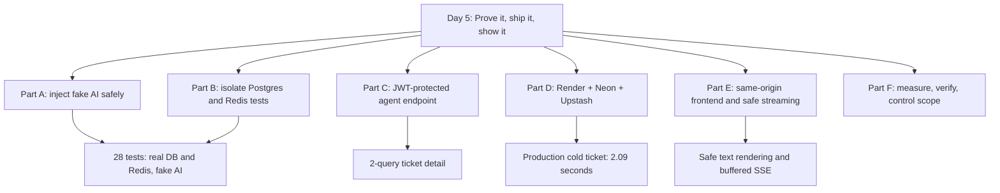

> **The main story:** You separated *your logic* from *external AI*, proved your test environment cannot accidentally clean the dev database, deployed the stack, and exposed a frontend that treats customer and LLM text as untrusted. The notes also record an unresolved public-registration security gap.

---


Day 5 turned a project that worked on one laptop into something **tested**,
**deployed on the internet**, and **usable by a stranger**.

Every idea from the day is explained below as if to a 15-year-old: what the
problem is, an everyday comparison, where it shows up in this project, and
one line you can say in an interview.

Live demo: https://ai-support-triage-4qzy.onrender.com/

---

## Contents

- **Part A** — Making the code testable (1–7)
- **Part B** — The test setup (8–16)
- **Part C** — The agent endpoint (17–19)
- **Part D** — Deploying (20–30)
- **Part E** — The frontend (31–37)
- **Part F** — Habits (38–42)
- **Part G** — Numbers to remember
- **Part H** — Interview questions to practise

---

# Part A — Making the code testable

<details open>
<summary><strong>Visual 1: The two different questions</strong></summary>

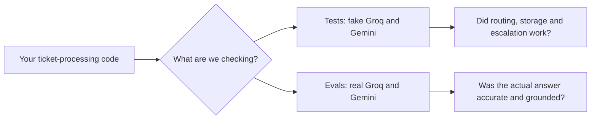

**Remember it this way:** A scripted fake is like practicing driving with cones: you control the situation so you can check your code. Evals use the real model to measure answer quality.

</details>

## 1. Why tests use a fake AI

**The problem.** A ticket needs three calls to AI services: Groq to classify,
Gemini to embed, Groq to draft. If every test made those calls for real, tests
would be:

- **slow** — about 2 seconds per ticket;
- **costly** — every run uses free-tier quota;
- **flaky** — they fail when the internet drops or the provider has a bad day;
- **unpredictable** — the same question gets differently worded answers.

That last one is the biggest. We actually saw it: the refund draft included
"Renewal charges are not refundable" in one run and left it out ten minutes
later. Same question, same documents, same model.

**The deeper reason.** To test the escalation path, you need the model to say
"The documentation does not cover this." A real model might, or might not.
You'd be hoping. A fake does exactly what you tell it.

**Everyday comparison.** A driving test uses a practice course with cones in
known places, not a random busy road. You're testing the driver, not the
traffic.

**Tests vs evals — they answer different questions:**

| | Tests (Day 5) | Evals (Day 6) |
|---|---|---|
| Question | Does **my code** do the right thing? | Is the **model's output** any good? |
| AI | Fake | Real |
| Runs | Every push, in seconds | On demand, costs API calls |
| A failure means | I broke my code | My prompt or retrieval needs work |

> **Interview line:** "Tests check my code's behaviour with a scripted fake
> model, so they're fast and deterministic. Model quality is measured
> separately, with evals against the real model."

---

<details open>
<summary><strong>Visual 2: Where FastAPI can swap a dependency</strong></summary>

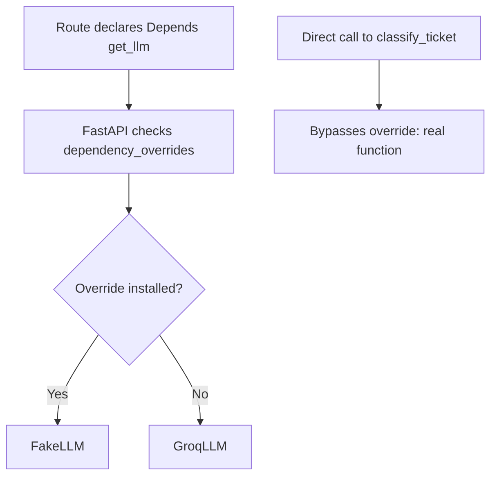

**Remember it this way:** The seam is the official handoff point. A direct Python call never visits FastAPI’s replacement table.

</details>

## 2. Seams, and what `dependency_overrides` can and can't reach

**The problem.** To use a fake, you need a place in the code where you can
swap the real thing for the fake. That place is called a **seam**.

**How FastAPI's override works.** `app.dependency_overrides` is a lookup table.
Just before FastAPI calls a dependency, it checks: "Is there a replacement for
this in the table?" If yes, it uses the replacement.

But FastAPI only checks the table for things it's in charge of — things
declared with `Depends(...)`. If your code imports a function and calls it
directly, FastAPI is never involved, so the table is never checked.

```
Route parameter:  db = Depends(get_db)   → FastAPI checks the table → fake used ✅
Inside the route: classify_ticket(text)  → plain Python call         → real Groq ❌
At import time:   engine = create_engine(...)  → ran before tests existed ❌
```

**Everyday comparison.** A restaurant where every ingredient comes through one
supplier. A health inspector can say "today, send labelled test ingredients"
and it works — unless a cook walks to the market himself. The inspector's
instruction never reaches him.

**What the audit found.** The plan said "use `dependency_overrides` to fake the
LLM." But the LLM wasn't a dependency. A `grep` search found **five** places
where the code reached outside without going through a seam:

1. Groq calls (classify, draft)
2. Gemini calls (embeddings)
3. The ingestion background task opening its own database session
4. Settings read at import time in `session.py` and `main.py`
5. A Redis client that tests would share with the dev app

> **Interview line:** "Overrides only work at dependency boundaries. Before
> writing tests, I audited where the app reached Postgres, Redis and the AI
> providers without going through injection."

---

<details open>
<summary><strong>Visual 3: Why the patch location matters</strong></summary>

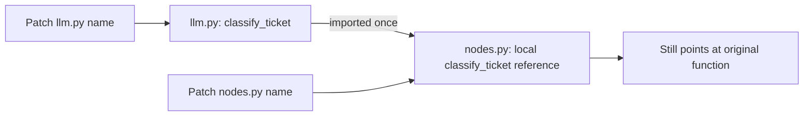

**Remember it this way:** Importing `from module import name` creates another name pointing to the function object. Patch the name the caller actually uses—or inject a client.

</details>

## 3. "Patch where it's looked up, not where it's defined"

**The problem.** There's another way to fake a function: `monkeypatch`, which
swaps a name inside a module during a test. It has a trap.

**How imports really work.** This line in `nodes.py`:

```python
from app.services.llm import classify_ticket
```

runs once, when the file is loaded. It **copies a reference** to the function
into `nodes.py`'s own list of names. After that, `nodes.py` never looks inside
`llm.py` again.

```
Patch app.services.llm.classify_ticket:
  llm.py    → classify_ticket → FAKE
  nodes.py  → classify_ticket → REAL   ← the node still calls this one
```

**Everyday comparison.** You saved a friend's number in your phone. They change
number and update the public directory. Your phone still dials the old number —
it never reads the directory again.

**Why it's dangerous here.** A wrong patch doesn't crash. It silently calls
the real API (see concept 13 for what happens next).

> **Interview line:** "Patching the defining module doesn't reach code that
> already imported the name. That's why I injected the clients instead."

---

<details open>
<summary><strong>Visual 4: One contract, two implementations</strong></summary>

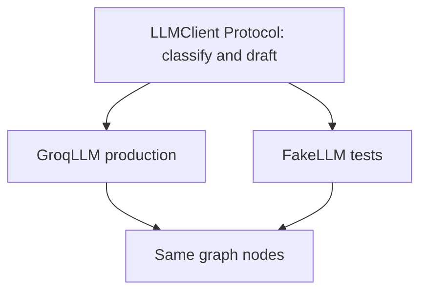

**Remember it this way:** The graph asks for capabilities, not a brand. Python `Protocol` is checked by static tooling, not enforced automatically at runtime.

</details>

## 4. Interfaces — Python `Protocol`

**The problem.** The graph needs "something that can classify and draft." In
production that's Groq; in tests, a fake. How does the graph accept either one
without an `if testing:` check?

**The idea.** Describe the **abilities** needed, not a specific class:

```python
class LLMClient(Protocol):
    def classify(self, subject: str, body: str) -> TicketCategory: ...
    def draft(self, question: str, context_chunks: list[str]) -> str: ...
```

Anything with those two methods fits. Both `GroqLLM` and the test's `FakeLLM`
fit, and the graph never knows which one it has.

**Everyday comparison.** A phone charging port. Original charger, cheap
charger, power bank — if the plug fits, it charges.

**`Protocol` vs `ABC`:**

- **ABC (abstract base class):** you only count if you *inherit* from it.
- **Protocol:** you count if you *have the right methods*. No inheritance
  needed. This is called **structural typing**, or "duck typing": if it walks
  like a duck and quacks like a duck, it's a duck.

We chose `Protocol` so test fakes don't need to import anything from
production code. Honest limit: Python doesn't enforce it while running — a
type checker like mypy does. A fake missing a method still fails loudly with
`AttributeError` when called.

> **Interview line:** "The graph depends on a `Protocol`, not on Groq. Tests
> pass in a fake that has the same methods."

---

<details open>
<summary><strong>Visual 5: Factory builds a node that remembers its tools</strong></summary>

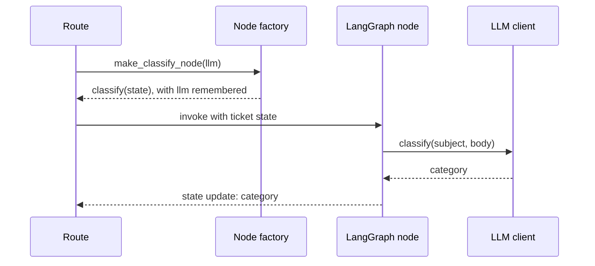

**Remember it this way:** The closure carries the LLM tool; state carries ticket data. Don’t place connection objects in state.

</details>

## 5. Factories and closures — and tools vs data

**The problem.** LangGraph calls every node with **one** argument: the state.
So how does a node get the LLM client or the database session?

**The answer: a factory.** A function that builds and returns another
function:

```python
def make_classify_node(llm):
    def classify(state):
        category = llm.classify(state["subject"], state["body"])
        return {"category": category}
    return classify
```

The inner function "remembers" `llm` even after `make_classify_node` has
finished. That remembering is called a **closure**.

**Everyday comparison.** A packed lunch. Your parent packs it in the morning
(the factory runs). At noon you open it (the node runs) — the food is still
there even though your parent isn't.

**Why not just put the client in the state?** State is **data about the
ticket**: subject, category, chunks, draft. It gets streamed to the browser,
checked in tests, and could be saved to storage. A client is a **tool** — it
can't be turned into JSON and has no business in an event stream.

> **Interview line:** "State holds data about the ticket; request-scoped tools
> like the DB session and LLM client reach nodes through closures."

---

<details open>
<summary><strong>Visual 6: Make missing tools an immediate error</strong></summary>

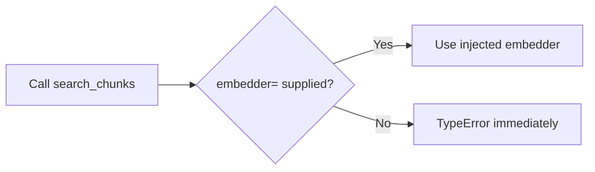

**Remember it this way:** A required keyword-only argument stops an omitted fake from silently falling back to a real provider.

</details>

## 6. Make mistakes loud: required keyword-only arguments

```python
def search_chunks(db, query, *, embedder: Embedder, top_k=3): ...
```

- The `*` means everything after it must be passed **by name**:
  `embedder=...`. Calls are easy to read.
- `embedder` has **no default**. Forget it and Python raises
  `TypeError: missing required keyword argument 'embedder'` immediately.

**Why not `embedder=GeminiEmbedder()` as a default?** Because then forgetting
it would silently use the **real** Gemini in a test. The whole point of the
refactor was to stop silent real calls.

**Rule:** a mistake that crashes loudly is much cheaper than one that quietly
does the wrong thing.

---

<details open>
<summary><strong>Visual 7: Choose the provider only at the boundary</strong></summary>

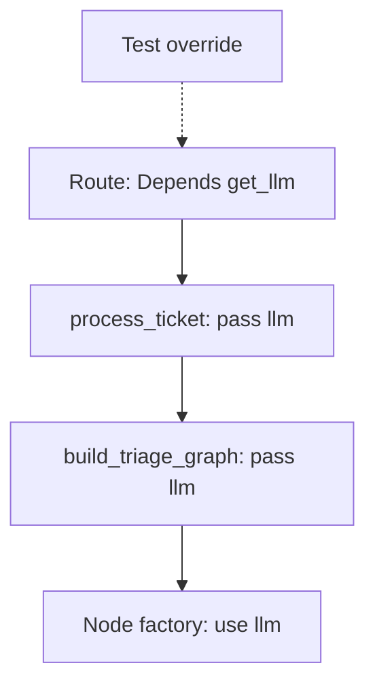

**Remember it this way:** Only the outermost route decides which implementation to use. Inner layers accept the choice rather than making a new one.

</details>

## 7. Only the outermost layer chooses the provider

```
Route  ── Depends(get_llm) ──► CHOOSES the provider (or the test's override)
  └─ process_ticket(llm)        just passes it on
       └─ build_triage_graph(llm)   just passes it on
            └─ node factory(llm)        uses it
```

If a middle layer called `get_llm()` itself, a test's override would never
reach below it. In scripts (which have no routes), the script itself is the
outermost layer, so it creates `GroqLLM()` directly.

**Proof it changed nothing:** after the refactor, `test_graph.py` and
`test_retrieval.py` gave **identical scores** to Day 3 and Day 4, to four
decimal places. A refactor should change structure, not behaviour — and this
one was verified, not assumed.

---

# Part B — The test setup

<details open>
<summary><strong>Visual 8: A pytest fixture’s lifetime</strong></summary>

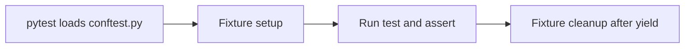

**Remember it this way:** Fixtures prepare reusable test ingredients. Function-scoped fixtures are fresh per test; session-scoped fixtures are shared across the run.

</details>

## 8. pytest basics

- **A test** is a function named `test_...` that uses plain `assert`. When it
  fails, pytest shows the actual values (`assert 503 == 200`).
- **A fixture** is something a test needs, prepared by pytest. The test asks
  for it by naming a parameter:

  ```python
  def test_health(client):     # "client" → pytest runs the client fixture
  ```

  This is dependency injection again — the same idea as `Depends`, used by the
  test framework.

- **`yield` in a fixture** splits it into setup (before) and cleanup (after),
  exactly like `get_db`.
- **Scope:** `function` (default) = fresh for every test; `session` = once for
  the whole run.
- **`conftest.py`** holds shared fixtures, and pytest loads it **before** any
  test file. That order is what the next concept depends on.
- **Within one test, a fixture is created once and shared.** So the `fake_llm`
  a test receives is the same object the `client` fixture installed. The test
  can set `fake_llm.reply = ...` and read `fake_llm.draft_calls`.

---

<details open>
<summary><strong>Visual 9: The safe startup order</strong></summary>

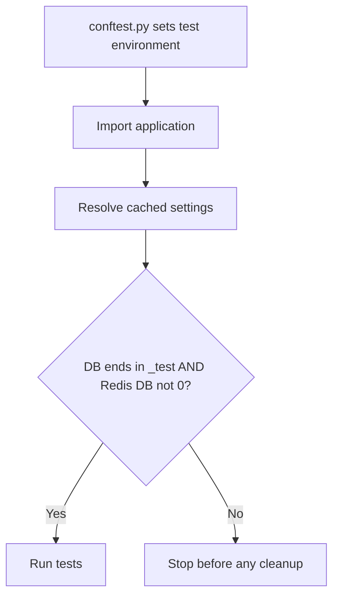

**Remember it this way:** The guard must inspect the settings the application resolved, not just the variables you intended to set.

</details>

## 9. Setting test configuration before the app loads

**The problem.** `session.py` builds the database engine **when it's first
imported**, and `get_settings()` is cached with `@lru_cache` — whatever values
exist at first call stay for the whole run. If the dev settings get read first,
tests use the **dev database**.

**The fix, in `conftest.py`:**

```
1. Set environment variables to test values (DB = triage_test, Redis = 15,
   fake API keys)
2. Only THEN import anything from app
3. Safety guard: refuse to run unless the DB name ends in _test
   and Redis isn't database 0
```

Two facts make this work:

- pytest loads `conftest.py` first.
- In `pydantic-settings`, a real environment variable beats the value in
  `.env`.

**The guard checks what the app actually resolved**, not what we set. Checking
`os.environ` proves what we *meant*; checking the settings object proves what
the app will *use*.

**We broke it on purpose:** pointed the tests at the dev database — they
refused to start. A guard you've never seen trigger is only a hope.

**Fake API keys are a tripwire:** if some code accidentally calls a real
provider, it gets a 401 instead of spending quota.

---

<details open>
<summary><strong>Visual 10: Test the real database shape</strong></summary>

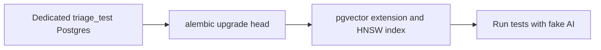

**Remember it this way:** Use the same migrations as production so tests also catch migration failures that `create_all()` would miss.

</details>

## 10. A real test database, built by migrations

Tests use real Postgres (`triage_test`), not SQLite, because SQLite can't run
pgvector. The schema is built with `alembic upgrade head` — the same way
production is built — not with `create_all()`, which would skip
`CREATE EXTENSION vector` and the hand-written HNSW index. Bonus: every test
setup also checks that the migrations work.

---

<details open>
<summary><strong>Visual 11: Every test starts clean—only in test resources</strong></summary>

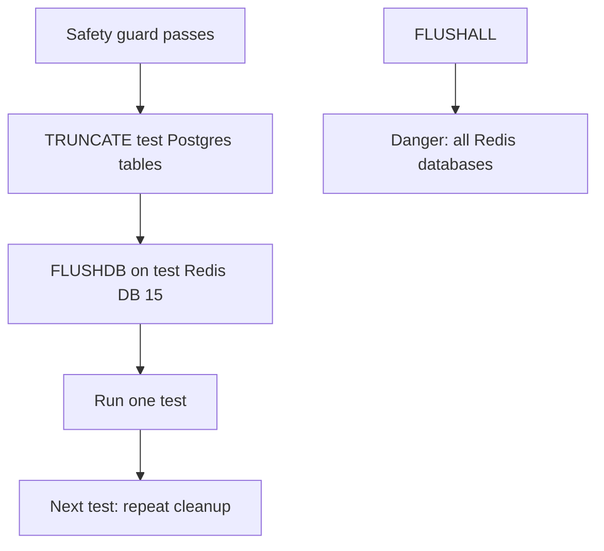

**Remember it this way:** Never run destructive cleanup without verifying the resolved database target. `FLUSHDB` affects only the selected Redis database; `FLUSHALL` affects all of them.

</details>

## 11. Test isolation — every test starts from the same state

**The problem.** If test A registers `admin@test.com` and test B registers the
same email, B fails with 409 — **only when A ran first.** A test whose result
depends on the order tests run in is broken.

**Two ways to reset:**

| | Transaction rollback | Truncate (empty the tables) |
|---|---|---|
| Speed | Faster | A few ms slower |
| Works here? | **No** | Yes |

Rollback fails for two reasons specific to this code:

1. The services call `db.commit()` themselves, which ends the test's
   transaction early.
2. The ingestion background task opens its **own** session — a separate
   connection whose writes are really committed.

**Clean before each test, not after.** If a test crashes, cleanup-after might
never run. Cleaning before means every test starts clean no matter what.

**`FLUSHDB`, never `FLUSHALL`:**

```
FLUSHDB  → empties only the connected Redis database (15 = test)
FLUSHALL → empties EVERY database on the server (including dev's 0)
```

> **Interview line:** "Each test starts from truncated tables and a flushed
> Redis database. Rollback couldn't work because services commit and the
> background task uses its own session."

---

<details open>
<summary><strong>Visual 12: Predictable fake embeddings</strong></summary>

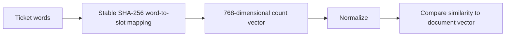

**Remember it this way:** The fake is deliberately simple but repeatable. Shared words tend to land in the same slots, letting you test both retrieval branches.

</details>

## 12. A fake embedder that behaves like a real one

**The problem.** If the fake returned random vectors, nothing would ever pass
the 0.55 similarity floor, every ticket would escalate, and you could never
test the "drafted" path.

**The trick: feature hashing.** Turn each word into a number from 0 to 767
with a hash, and count words per slot. Texts that share words get similar
vectors.

```
"refund window days" → slots 412, 88, 301 get a 1 → normalise to length 1
"refund days"        → shares 2 words → high similarity → passes the floor
"football match"     → shares nothing → similarity 0  → fails the floor
```

**Everyday comparison.** Shelving books by the first word of the title.
Crude, but "Refund Policy" and "Refund Guide" end up on the same shelf.

**`hashlib`, not Python's `hash()`**: Python scrambles `hash()` for text
differently on every run (a security feature). Tests would get different
vectors each time. `sha256` always gives the same answer.

**We tested the fake itself** (5 tests), because every retrieval test depends
on "shared words pass, unrelated words don't." Check an assumption once,
directly, and you can trust it everywhere.

---

<details open>
<summary><strong>Visual 13: A green test can still be wrong</strong></summary>

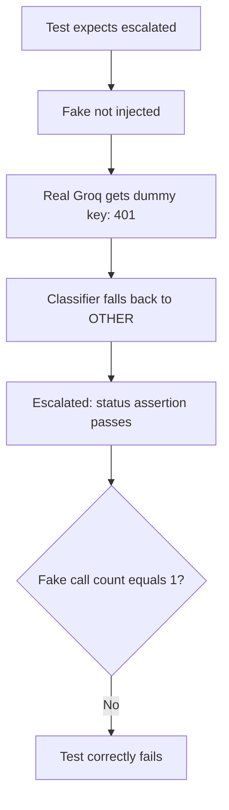

**Remember it this way:** Check both the output **and** evidence that the intended fake was called. Otherwise a fallback can hide a broken test.

</details>

## 13. The false pass — and how fakes that record calls catch it

This is the best story of the day.

**The trap.** `classify_ticket` never raises: on failure it returns `OTHER`,
and `OTHER` escalates. So if the fake isn't wired in:

```
real client → dummy key → Groq 401 → returns OTHER → ticket escalates → 201
test checks "status == escalated" → PASSES ✅ …while testing nothing
```

**The defence.** The fakes write down every call they receive. Every ticket
test also checks `len(fake_llm.classify_calls) == 1` — proof the fake was
actually used.

**We proved it on purpose:**

- Removed the override → the status check passed, the call-count check
  caught it (`assert 0 == 1`).
- Also removed the call-count check → the test **passed while testing
  nothing**.
- Restored both → 20 passed.

> **Interview line:** "My classifier falls back to OTHER on failure, and OTHER
> escalates — so a status-only test passes even with the fake disconnected. I
> demonstrated that on purpose. Asserting the fake was called is what catches it."

---

<details open>
<summary><strong>Visual 14: Where test time goes</strong></summary>

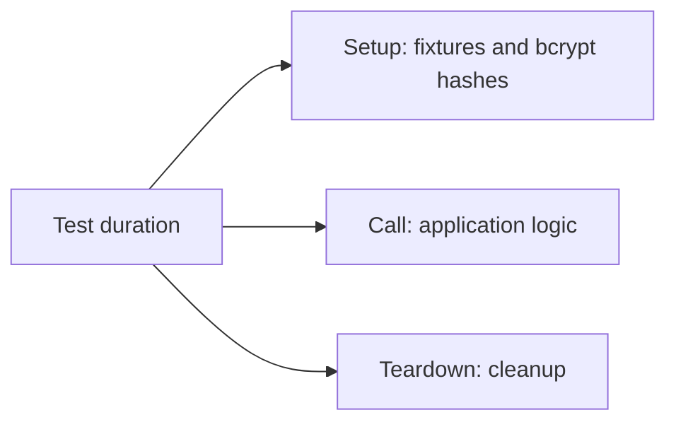

**Remember it this way:** `--durations` helps you optimize the real bottleneck rather than assuming the test body is slow.

</details>

## 14. Reading test timings

`--durations` showed the slowest parts were **`setup`**, not `call`:

- **call** = time inside the test
- **setup** = time building its fixtures

Each ~0.48 s setup was two bcrypt password hashes in the login fixtures. So
most of the suite's time was **password hashing**, not app logic. That's the
Day 2 security cost, visible in test timings. If the suite ever gets slow, the
fix is a lower bcrypt cost in tests only.

---

<details open>
<summary><strong>Visual 15: Warnings are early security feedback</strong></summary>

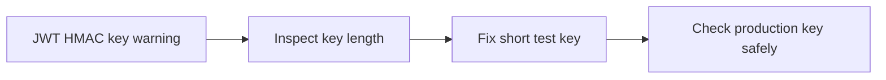

**Remember it this way:** A warning is an investigation prompt. Avoid suppressing all warnings; fix or narrowly document the specific cause.

</details>

## 15. Warnings are signals, not noise

A test run printed:

```
InsecureKeyLengthWarning: The HMAC key is 30 bytes long … below 32 bytes
```

- Your JWT is signed with **HMAC-SHA256**: a hash of the token mixed with your
  secret key. A short key is easier to guess, and a guessed key lets anyone
  forge tokens with `"role": "admin"`.
- The test key was 30 bytes → fixed. Then we checked the real key: 43 bytes, fine.

This was only caught because warnings were left visible. **Never mute
warnings in general** — only a specific, understood one.

---

<details open>
<summary><strong>Visual 16: Turn review rules into repeatable checks</strong></summary>

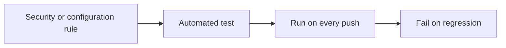

**Remember it this way:** A test that detects `innerHTML` or `.env.example` drift keeps the rule alive when you forget it.

</details>

## 16. Turn rules into tests

Two rules became automatic checks that run on every push:

- **No `innerHTML` in the frontend** (see concept 34) — a test reads the file
  and fails if the word appears.
- **`.env.example` matches the real settings** — every required setting is
  listed, and no unknown names. It had already drifted: `GROK_API_KEY`
  (typo for `GROQ`), two settings missing. `pydantic-settings` ignores unknown
  variables silently, which is how the typo went unnoticed.

A rule in a reviewer's head gets forgotten. A rule in a test doesn't.

---

# Part C — The agent endpoint

<details open>
<summary><strong>Visual 17: Authentication is not authorization</strong></summary>

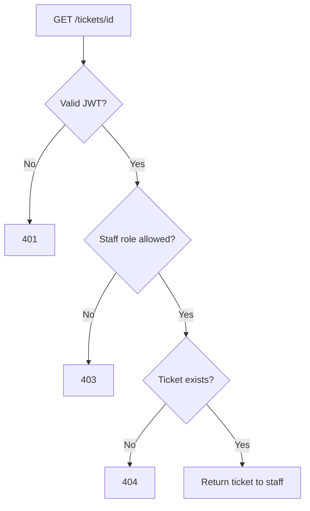

**Remember it this way:** First prove identity; then check permission. If customer accounts are added later, also check whether the customer owns the requested ticket.

</details>

## 17. Authentication vs authorisation — and IDOR

- **Authentication** = *who are you?* (your JWT)
- **Authorisation** = *are you allowed to do this?* (role checks)

Authorisation has two levels:

```
Function level: "Can agents call GET /tickets/{id} at all?"   → role check
Object level:   "Can THIS user read THIS ticket?"              → ownership check
```

**IDOR** (Insecure Direct Object Reference), which OWASP ranks **#1** for APIs
as "broken object level authorization": a customer portal checks "logged in?"
but not "is this *your* order?" Change the number in the URL and you read a
stranger's order.

**In this project, no ownership check is correct:** every account is staff,
and staff read the whole queue. The docstring says that if customer accounts
are ever added, an ownership check becomes mandatory. Explaining *why* one
isn't needed beats blindly adding one.

---

<details open>
<summary><strong>Visual 18: Why one join beats N+1</strong></summary>

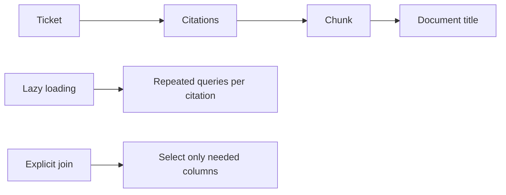

**Remember it this way:** Three citations produced eight queries with the naive approach. Your explicit join gave two queries regardless of citation count.

</details>

## 18. The N+1 query problem

**The problem.** A citation's document title is two hops away:
`citation → chunk → document`. Walking those relationships the obvious way
loads each hop **separately**:

```
ticket           1 query
citations        1 query
  each chunk     1 query  × N
  each document  1 query  × N
3 citations = 8 queries.
```

**Everyday comparison.** Going to the shop once per ingredient instead of with
one list.

**Two fixes:**

- **Eager loading** — fixes the count but loads whole objects, including
  `Document.raw_text`, the **entire uploaded file**, just to read a title.
- **One explicit join selecting four columns** ← chosen.

Verified with `engine.echo = True`: exactly **2 queries**, whatever the
number of citations.

> **Interview line:** "Lazy relationships would have been N+1. I used one join
> selecting only the four columns needed, and verified two queries with echo."

---

<details open>
<summary><strong>Visual 19: HTTP errors tell different stories</strong></summary>

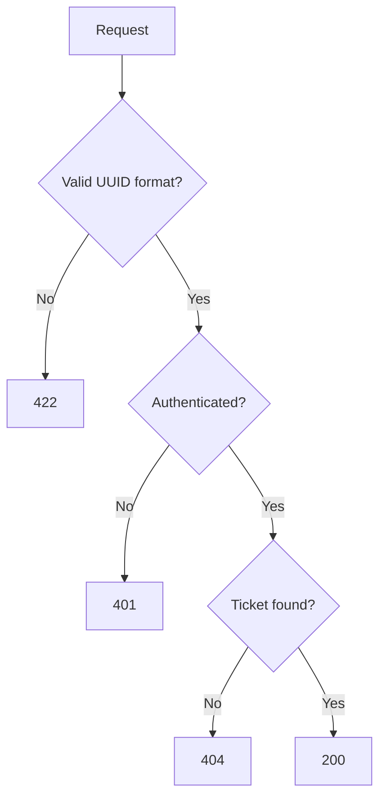

**Remember it this way:** 422 means the input format failed; 401 means identity failed; 404 means the resource was not found.

</details>

## 19. Status codes that mean something

| Situation | Code | Why |
|---|---|---|
| No token | 401 | Not authenticated |
| Token fine, ticket doesn't exist | 404 | Not found |
| ID isn't even a valid UUID | 422 | FastAPI rejected the input before your code ran |

Two 401 messages exist: "Not authenticated" (no header at all — FastAPI's
check) and "Could not validate credentials" (bad token — your check).
Harmless: neither reveals which accounts exist.

---

# Part D — Deploying

<details open>
<summary><strong>Visual 20: The production architecture</strong></summary>

```mermaid
flowchart TD
 A[GitHub push] --> B[Render builds Dockerfile]
 B --> C[FastAPI container: Singapore]
 C --> D[Neon Postgres + pgvector: Singapore]
 C --> E[Upstash Redis over TLS: Singapore]
 F[Browser] --> C
```

**Remember it this way:** Deployment turns your laptop-only code into a service. Migrate the database, start the app, seed demo data, then verify the live behavior.

</details>

## 20. What deploying means here

```
GitHub ──► Render builds your Dockerfile ──► container runs your app
                                               ├─► Neon    (Postgres + pgvector)
                                               └─► Upstash (Redis, over TLS)
All three in Singapore.
```

Order matters: **database schema first** (migrations on Neon), then the app,
then data (seeding), then verification.

---

<details open>
<summary><strong>Visual 21: Why production Redis uses TLS</strong></summary>

```mermaid
flowchart LR
 A[Render app] --> B[rediss:// TLS encrypted connection]
 B --> C[Upstash Redis]
 D[Local app] --> E[redis:// private local connection]
 E --> F[Local Redis]
```

**Remember it this way:** The first connection pays for handshake and authentication; reusing the client avoids paying that cost for every command.

</details>

## 21. TLS — `redis://` vs `rediss://`

Locally, Redis traffic never leaves your machine. In production, your app on
Render talks to Upstash **across the internet**, where plain text (including
the password) can be read by anyone in between.

```
redis://   plain text — fine inside Docker's private network
rediss://  encrypted with TLS — required across the internet
```

TLS = the same encryption as the "s" in `https`.

**The cost, measured:** first Upstash PING from Delhi **815 ms** (connect + TLS
handshake + password), second **93 ms** (reused connection). The handshake
happens once per connection — which is why `cache.py` keeps one client and
reuses it.

---

<details open>
<summary><strong>Visual 22: Keep chatty services close</strong></summary>

```mermaid
flowchart TD
 A[Render Singapore] -->|Short regional hop| B[Neon Singapore]
 A -->|Short regional hop| C[Upstash Singapore]
 D[Developer in Delhi] -->|Longer internet hop| A
```

**Remember it this way:** When a request makes several DB/cache calls, cross-region round trips add up. The Delhi measurements are observations, not a guaranteed network speed.

</details>

## 22. Put everything in the same region

Every request makes several database and cache calls. Each call pays the
distance:

```
Delhi → Singapore:      ~93 ms per Upstash command (measured)
Singapore → Singapore:  ~1 ms
```

So the app, database and cache all live in Singapore. If one were in the US,
every one of those calls would cost ~200 ms instead of ~1 ms.

---

<details open>
<summary><strong>Visual 23: Idle services and waking up</strong></summary>

```mermaid
flowchart LR
 A[No traffic] --> B[Render app sleeps]
 A --> C[Neon compute suspends]
 D[New visitor] --> E[Render wakes]
 E --> F[Pool pre-ping replaces stale DB connections]
 F --> G[Request proceeds]
```

**Remember it this way:** Stored data and running compute are different things. A sleeping database can keep data while its old connections stop working.

</details>

## 23. What "free tier" really does

- **Render** stops your app after **15 minutes** with no requests; waking takes
  **about a minute**.
- **Neon** suspends the database after **5 minutes** idle; waking takes **a few
  hundred milliseconds**.

**Correction learned today:** the Day 0 log said Neon's free tier "doesn't
pause." Wrong — the **data** is permanent, the **compute** pauses. Found by
checking current docs before deploying.

**A Day 1 decision paid off:** when Neon pauses, it drops every connection.
`pool_pre_ping=True` tests each pooled connection before use and replaces dead
ones. Without it, the first request after every pause would fail.

**Honest handling:** the README tells visitors about the one-minute wake-up. A
keep-alive ping service would hide it but isn't officially supported — and
would burn your Upstash quota through `/health`.

---

<details open>
<summary><strong>Visual 24: Connection-string choices</strong></summary>

```mermaid
flowchart TD
 A[Neon URL] --> B[postgresql+psycopg:// for psycopg 3]
 B --> C{Workload?}
 C -->|Long-running app with own pool| D[Direct connection]
 C -->|Serverless many short connections| E[Consider pooler]
 D --> F[Migrations use direct connection]
```

**Remember it this way:** The URL prefix selects the SQLAlchemy driver. Your notes chose a direct Neon endpoint for the app and migrations.

</details>

## 24. Connection strings — two traps

**The driver name.** Neon gives `postgresql://...`. SQLAlchemy reads that as
"use psycopg2," which isn't installed. It must be `postgresql+psycopg://...`
(psycopg 3). Otherwise the app crashes on startup.

**Pooled vs direct.** Neon offers a `-pooler` address (a separate
connection-pooling server) for serverless code that opens a fresh connection
per request. Your app is one long-running process with its own SQLAlchemy
pool, and migrations need a direct connection. So: **direct**.

---

<details open>
<summary><strong>Visual 25: A container that starts and stops correctly</strong></summary>

```mermaid
flowchart TD
 A[Render sets PORT] --> B[Shell expands PORT default 8000]
 B --> C[exec uvicorn becomes PID 1]
 C --> D[SIGTERM arrives at uvicorn]
 D --> E[Graceful shutdown]
 F[Run as appuser] --> G[Lower privileges]
```

**Remember it this way:** `exec` forwards shutdown signals to the server process, and a non-root user limits damage if the container is compromised.

</details>

## 25. Containers for production

Three changes to the Dockerfile, all verified:

**1. Read the port from `$PORT`.** The platform picks the port (Render used
10000). `${PORT:-8000}` means "use `$PORT` if set, otherwise 8000."

**2. `exec`, so shutdown signals arrive.**

```
Without exec: PID 1 = sh → sh ignores SIGTERM → Docker waits → force-kills uvicorn
With exec:    PID 1 = uvicorn → gets SIGTERM → finishes requests → exits cleanly
```

- **PID 1** = the first process in the container; it receives stop signals.
- **SIGTERM** = "please stop." **SIGKILL** = forced stop.

Measured: `docker stop` in **0.885 s**. (The version without `exec` wasn't
measured — don't quote a "before" number you don't have.)

**3. Don't run as root.** If an attacker ever ran code inside the container,
root would give them everything. `whoami` → `appuser`.

---

<details open>
<summary><strong>Visual 26: Keep development and production secrets apart</strong></summary>

```mermaid
flowchart TD
 A[Dev environment] --> B[Dev JWT key]
 C[Production environment] --> D[Different production JWT key]
 E[Secret entered in dashboard] --> F[Name field + value field]
```

**Remember it this way:** A development-key leak should not let anyone sign production tokens. Never commit or display full secrets.

</details>

## 26. Secrets

- **Every environment gets its own secrets.** A new production JWT key was
  generated — if your laptop's dev key leaked, it must not be able to sign
  production tokens.
- **Keep secrets out of history and screenshots:** `read -s` (hidden typing),
  `getpass` in Python, `unset` when done.
- **Check a secret without showing it:** print only the part before the first
  colon (`${VAR%%:*}`) or the first few characters. That's how the Upstash
  paste mistake (`REDIS_URL="rediss://..."` pasted whole) was found safely.
- **In a platform's settings,** the name goes in one field and the value in
  another — no quotes, no `NAME=`.

---

<details open>
<summary><strong>Visual 27: Health check as a deployment gate</strong></summary>

```mermaid
flowchart TD
 A[Render starts new version] --> B[GET /health]
 B --> C{Dependencies healthy?}
 C -->|Yes| D[New version can serve]
 C -->|No: 503| E[Deployment fails health gate]
```

**Remember it this way:** A deep health check verifies dependencies but can itself cost network requests. A cheap liveness route and deeper readiness route can separate those concerns.

</details>

## 27. Health checks gate deploys

Render calls `/health` on each new version. If it fails (say, the new version
can't reach Neon), **the new version doesn't go live** and the working one
keeps serving. That's the Day 1 decision to return 503 when degraded, now doing
its real job.

**The cost:** your `/health` is a **deep** check — a Neon query and a new
Upstash TLS connection every time, and the logs show Render calling it
constantly. Many teams split a cheap `/health` from a deeper `/ready`. How often
Render calls it on the free tier is still to be measured.

---

<details open>
<summary><strong>Visual 28: Schema changes before app changes</strong></summary>

```mermaid
flowchart LR
 A[Create migration] --> B[Run Alembic against Neon]
 B --> C[Deploy code needing new schema]
 C --> D[Verify health]
```

**Remember it this way:** On your free deployment, migration is a manual step. Pushing code first risks deploying a version that expects a missing column.

</details>

## 28. Migrations must run before the code that needs them

On paid Render plans, a **pre-deploy command** runs `alembic upgrade head`
automatically before each new version starts. On the free plan it's locked, so
migrations are run by hand against Neon from WSL. The risk: push code that
needs a new column before migrating, and the new deploy crashes.

---

<details open>
<summary><strong>Visual 29: Safe repeatable seeding</strong></summary>

```mermaid
flowchart TD
 A[Run seed script] --> B[Create demo staff and docs]
 B --> C{Already exists: 409?}
 C -->|Yes| D[Treat as already done]
 C -->|No| E[Create and ingest]
 D --> F[Ask deployed app to verify admin role]
 E --> F
```

**Remember it this way:** Idempotent means running the same setup repeatedly does not duplicate or damage existing demo records. Verify the result through the deployed app.

</details>

## 29. Seeding production — idempotent, and checked by effect

`scripts/seed_production.py` creates the demo agent, an admin, and uploads the
three documents.

- **Idempotent** = safe to run again. A 409 ("already exists") counts as done.
  We ran it three times without harm.
- **Imports nothing from `app`**, so local `.env` settings can't leak into a
  production operation.
- **Checks the effect, not just the step.** Promoting the admin goes through
  the database URL; registering goes through the website URL. If those pointed
  at different databases, the promotion would do nothing useful. So the script
  asks the **deployed** app "what's my role?" and stops if it isn't `admin`.
- **Polls until ready** — the Day 2 "202 + check status" contract, used by a
  real client for the first time.

---

<details open>
<summary><strong>Visual 30: Public registration crossed a trust boundary</strong></summary>

```mermaid
flowchart TD
 A[Anonymous internet visitor] --> B[Public /auth/register]
 B --> C[Agent account]
 C --> D[Can read entire staff ticket queue]
 E[Planned fix] --> F[Admin invites staff / least privilege / rate limiting]
```

**Remember it this way:** This is a documented deployment-time security gap in the notes, not something the existing JWT check solves.

</details>

## 30. A security gap that appeared only after deploying

`POST /auth/register` is public and creates **agent** accounts, and agents can
read every ticket. On a laptop that's harmless. On the internet, **anyone can
make themselves staff**. We even used it to re-create the demo account.

**How real systems avoid this:**

- **Invite-only** — admins create staff accounts.
- **Lowest privilege by default** — public sign-up gives a role that can't see
  anything sensitive.
- **Single sign-on** — only company employees can log in at all.

The principle: **the default must be the least privilege.** Planned for
Day 12 (closed registration + admin-created accounts + rate limiting), and
stated in the README's known limitations.

---

# Part E — The frontend

<details open>
<summary><strong>Visual 31: One origin, one application</strong></summary>

```mermaid
flowchart LR
 A[Browser loads frontend from Render] --> B[Same Render origin]
 A --> C[Calls /tickets and /auth on same origin]
 B --> D[FastAPI]
 C --> D
```

**Remember it this way:** Serving the page and API from the same scheme, host and port avoids cross-origin configuration for your frontend.

</details>

## 31. Same origin, and why it avoids CORS

An **origin** = scheme + host + port (`https://…onrender.com:443`).

Browsers only let a page's JavaScript read responses from **its own origin**,
unless the other side explicitly allows it. That permission system is **CORS**.
The rule exists so a random website can't use your logged-in browser to read
your bank's API.

**Everyday comparison.** A building intercom. Residents talk freely; a visitor
gets in only if a resident buzzes them.

**Chosen:** FastAPI serves the page itself, so page and API share an origin —
no CORS setup at all. The classic mistake in the other design (separate
frontend host) is setting CORS to `*` to make errors go away, which just turns
the protection off.

---

<details open>
<summary><strong>Visual 32: Why StaticFiles must be last</strong></summary>

```mermaid
flowchart TD
 A[Incoming path] --> B[Match API routes first]
 B --> C{API route matches?}
 C -->|Yes| D[Run API endpoint]
 C -->|No| E[Last mounted StaticFiles at /]
 E --> F[Serve index.html or asset]
```

**Remember it this way:** A root mount matches every path. Register it after `/health`, `/tickets` and `/docs` so it does not hide them.

</details>

## 32. Serving the page — and a hang that taught something

- `StaticFiles` serves files from `app/static/`. `html=True` makes `/` return
  `index.html`.
- **Mounted last.** Routes are checked in order, and a mount at `/` matches
  everything. Mounted first, it would **shadow** (hide) `/health`, `/tickets`
  and `/docs`. A test checks this.
- **Inside `app/`**, because the Dockerfile only copies `app/`. A top-level
  `static/` would work locally and crash in production.

**What broke:** the mount was saved before the folder existed. `StaticFiles`
checks at startup → the app crashed → but with `--reload`, the parent process
kept port 8000 open, so requests **hung** instead of failing.

```
Nothing listening   → connection refused instantly (Day 4's HTTP 000)
Listening, no app   → hangs forever
```

`--reload` only watches `.py` files, so creating the folder didn't fix it — a
restart did. Since then, every `curl` in a check uses `--max-time`.

Good news hidden in the crash: failing **at startup** is the best kind of
failure. On Render, the health check would fail and the broken version would
never go live.

---

<details open>
<summary><strong>Visual 33: Network chunks are not complete events</strong></summary>

```mermaid
flowchart LR
 A[fetch POST stream] --> B[Receive arbitrary byte chunks]
 B --> C[Append to text buffer]
 C --> D{Blank-line event delimiter present?}
 D -->|Yes| E[Parse complete event]
 D -->|No| F[Wait for more chunks]
 E --> G[Keep incomplete remainder]
 G --> B
 F --> B
```

**Remember it this way:** One event can arrive in three network chunks—or three events in one chunk. Parse by the SSE delimiter, not by the read boundaries.

</details>

## 33. Reading a stream in the browser — "framing"

**The problem.** The browser's built-in `EventSource` only does `GET`. Your
stream endpoint is a `POST` with a JSON body. So the page uses `fetch()` and
reads the response piece by piece.

**The real difficulty:** network pieces don't line up with events.

```
Server sends:   data: {"stage":"received"}\n\n data: {"stage":"classified"}\n\n
Piece 1:        data: {"stage":"rece
Piece 2:        ived"}\n\ndata: {"stage":"classi
Piece 3:        fied"}\n\n
```

Parsing piece 1 as JSON would fail. So: keep a **buffer**, add each piece,
cut off only **complete** events (ending in a blank line), keep the leftover
for next time.

**Everyday comparison.** A letter delivered in torn strips. Tape them together
and read a sentence only once its full stop arrives.

This is called **framing** — deciding where one message ends. TCP delivers a
stream of bytes, not messages, so framing is always the reader's job.

---

<details open>
<summary><strong>Visual 34: Treat tickets and LLM output as text</strong></summary>

```mermaid
flowchart TD
 A[Untrusted ticket or model output] --> B{How inserted into page?}
 B -->|innerHTML| C[Browser interprets markup: XSS risk]
 B -->|textContent| D[Browser displays literal text]
```

**Remember it this way:** The stored ticket is an attacker-controlled input. Your test ensures the agent panel displays it as text rather than executing markup.

</details>

## 34. XSS — the agent panel's biggest danger

The agent page shows text **your code didn't write**: the ticket body (typed
by a stranger) and the draft (written by an LLM the stranger can influence).

```js
element.innerHTML   = text;  // browser PARSES it: tags become real elements
element.textContent = text;  // shown as plain characters, always
```

**The attack (XSS, cross-site scripting):** a stranger submits a ticket
containing ``. With `innerHTML`,
when an agent opens it, that code runs **inside the agent's logged-in page**.
This is **stored XSS**: the trap waits in your database for a privileged user.

**The LLM makes it worse:** a ticket can try to make the model *output* HTML.
Treat model output as untrusted user input, always.

**Everyday comparison.** Reading a letter aloud vs doing what it says.

**We attacked our own page:** the `` payload was displayed as
literal text, no popup. And a test fails if `innerHTML` ever appears.

---

<details open>
<summary><strong>Visual 35: Where the JWT lives</strong></summary>

```mermaid
flowchart TD
 A[JWT token] --> B[localStorage: survives reload, script-readable]
 A --> C[JS memory: lost on reload, still script-accessible]
 A --> D[HttpOnly cookie: not script-readable, requires CSRF planning]
```

**Remember it this way:** Memory storage limits persistence, but does not make XSS harmless. Token storage is one layer, not a substitute for safe rendering.

</details>

## 35. Where to keep the login token

| Storage | Survives reload | Readable by injected script |
|---|---|---|
| `localStorage` | yes | **yes, easily** |
| JavaScript variable (chosen) | no | harder, not impossible |
| `HttpOnly` cookie | yes | **no** (JavaScript can't read it at all) |

Memory storage **reduces** damage, it doesn't prevent it. The real defence is
not having XSS at all. `type="module"` also keeps the token out of the global
scope. The production-grade answer is an HttpOnly cookie (with CSRF
protection) — listed as a next step.

---

<details open>
<summary><strong>Visual 36: Client-side checks vs server enforcement</strong></summary>

```mermaid
flowchart LR
 A[Browser form validation] --> B[Convenient immediate feedback]
 C[Direct API caller] --> D[Bypasses browser form]
 D --> E[Server Pydantic validation]
 A --> E
```

**Remember it this way:** Anything enforced only in the browser can be skipped by calling the API directly.

</details>

## 36. Browser checks are convenience, not security

`minlength`, `maxlength` and `required` on the form give instant feedback.
But anyone can skip the page and call the API directly. The **server's**
Pydantic validation is what actually enforces the rules. Same lesson as Day 2's
content-type check.

---

<details open>
<summary><strong>Visual 37: Similarity is not confidence</strong></summary>

```mermaid
flowchart LR
 A[Top retrieval similarity: 0.663] --> B[How close is the retrieved text?]
 B --> C[Does NOT mean 66.3 percent answer correctness]
```

**Remember it this way:** Similarity helps retrieval and routing, but a highly similar document can still lack the answer.

</details>

## 37. Label numbers honestly

The page shows "0.663 (top source similarity, not a probability)." Without
that label, an agent would read 0.66 as "66% sure the answer is right," which
it isn't — Day 3 showed unanswerable questions can score just as high.

---

# Part F — Habits (the lessons behind the lessons)

<details open>
<summary><strong>Visual 38: Claims versus evidence</strong></summary>

```mermaid
flowchart LR
 A[Run a check] --> B[Capture output]
 B --> C[Confirm actual effect]
 C --> D[Only then say done]
```

**Remember it this way:** A command running is not proof it achieved the intended result. Keep the output that demonstrates success.

</details>

## 38. "Done" isn't evidence

The demo password check was reported as "done" without its output. The wrong
password (`123456789`) reached production and was only found later in the
browser. The check existed precisely to catch that. **Output is evidence;
"done" is a claim.**

<details open>
<summary><strong>Visual 39: Always attach context to performance numbers</strong></summary>

```mermaid
flowchart TD
 A[Measured duration] --> B{Cold or cached?}
 A --> C{Local or production?}
 A --> D{From which region?}
 B --> E[Quote number with context]
 C --> E
 D --> E
```

**Remember it this way:** A cached 1.25-second browser request and a cold 2.09-second production request measure different conditions.

</details>

## 39. Measure, and quote numbers with their context

- 1.25 s in the browser was **partly cached** — the cold production number is
  **2.09 s**.
- 1559 ms to Neon was a **warm** connection from Delhi, not a cold start.
- The two `/health` timings differed for an unmeasured reason (probably DNS) —
  so it's recorded as "probably," not as fact.

An interviewer's favourite question is "how did you measure that?"

<details open>
<summary><strong>Visual 40: Prove the guard can fail</strong></summary>

```mermaid
flowchart LR
 A[Deliberately break test DB target] --> B[Guard refuses]
 C[Remove fake override] --> D[Call-count assertion fails]
 E[Submit XSS payload] --> F[Rendered as literal text]
```

**Remember it this way:** Safety controls are stronger when you have observed them detect the exact failure they were designed to catch.

</details>

## 40. Break it on purpose

Three times today: the database guard (refused), the missing LLM override
(caught by the call count), the XSS payload (shown as text). A safety check
you've never seen trigger is only a hope.

<details open>
<summary><strong>Visual 41: Name values once, reuse safely</strong></summary>

```mermaid
flowchart LR
 A[Set TICKET_ID once] --> B[Use quoted variable in commands]
 B --> C[Fewer placeholder and spacing errors]
```

**Remember it this way:** Store an identifier once instead of repeatedly pasting it into long commands.

</details>

## 41. Put values in variables, not in the middle of commands

`PASTE_ID_HERE` was sent twice, and a missing space turned a header into a
second URL. Setting `TICKET_ID=...` once, then using `"$TICKET_ID"`, removes
both mistakes.

<details open>
<summary><strong>Visual 42: Scope is a technical decision</strong></summary>

```mermaid
flowchart TD
 A[New idea: customer chat replies] --> B[Needs migration]
 B --> C[Needs per-ticket access design]
 C --> D[Estimate 1.5 to 2.5 hours]
 D --> E[Defer to future work]
```

**Remember it this way:** A feature that requires new authorization and schema work is not a harmless UI tweak. Record it and ship the verified scope first.

</details>

## 42. Control scope

"Let agents reply to customers in the chat" is a good idea — but it needs a
migration, a new access design (a per-ticket customer token, not the ticket
ID), and 1.5–2.5 hours. It went into "what I'd do next" with the reasoning.
Knowing what *not* to build today is part of engineering.

---

# Part G — Numbers to remember

| What | Number | Context |
|---|---|---|
| Cold ticket, local | 2.04–2.11 s | real Groq + Gemini |
| **Cold ticket, production** | **2.09 s** | streamed, from Delhi |
| All caches warm | 0.062 s | identical text only |
| Share of latency in external APIs | ~95% | pgvector: 5–18 ms |
| Refactor overhead | none measurable | 2.11 s vs 2.04 s, within variance |
| Test suite | 28 tests, ~6.5 s | real Postgres + Redis, fake AI |
| bcrypt per hash | ~0.22 s | most of the test time |
| Agent endpoint | 2 queries | whatever the citation count |
| Upstash from Delhi | 815 ms first / 93 ms reused | TLS handshake cost |
| Graceful stop | 0.885 s | with `exec` |
| Unanswerable question's top score | 0.6495 | escalated on the refusal sentence |
| Production Postgres | 18.6 (local 16) | mismatch, fix on Day 7 |

---

# Part H — Interview questions to practise out loud

1. How do you test code that calls an LLM? Why not call the real model?
2. What's the difference between a test and an eval?
3. Why didn't `dependency_overrides` work at first, and what did you change?
4. Walk me through the false pass. What catches it?
5. Why truncate tables instead of rolling back a transaction?
6. What's IDOR? Why doesn't your agent endpoint need an ownership check?
7. What's the N+1 problem? How did you avoid it, and how did you prove it?
8. What does `exec` do in your Dockerfile, and why does it matter on every deploy?
9. Why is everything in the same region? Give your measured numbers.
10. What's XSS, and why is your agent page a target? How did you test your defence?
11. Why can't you use `EventSource` for your stream, and what's the hard part of reading it yourself?
12. What security problem appeared only after deploying, and how will you fix it?
13. What does your free-tier deployment do after 15 idle minutes, and how did you handle that honestly? this created by claude learning of day 5 . you have to same like you did with day 4 learning. 
