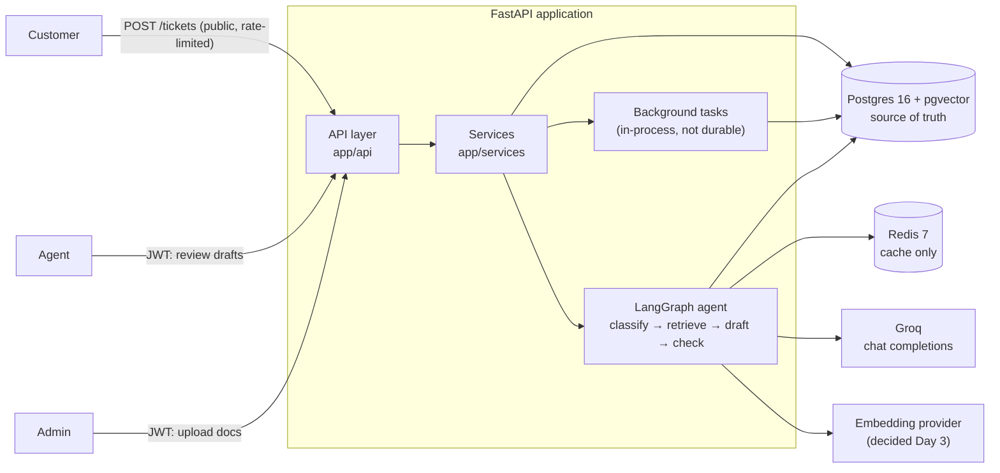
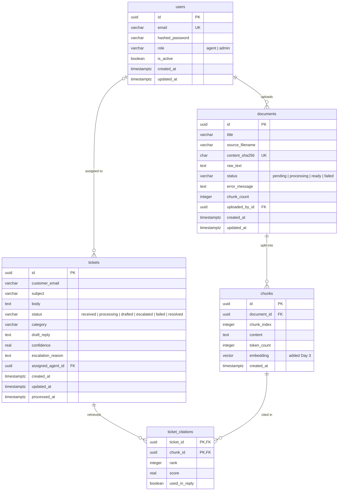
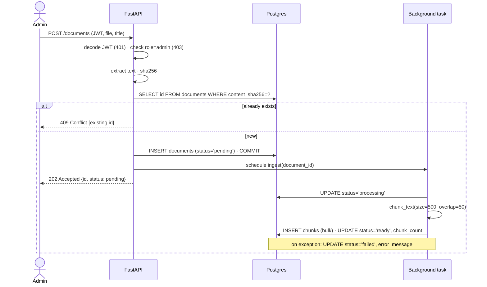
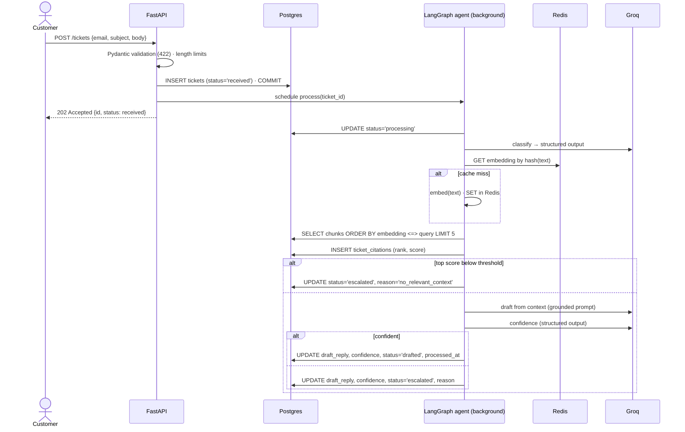
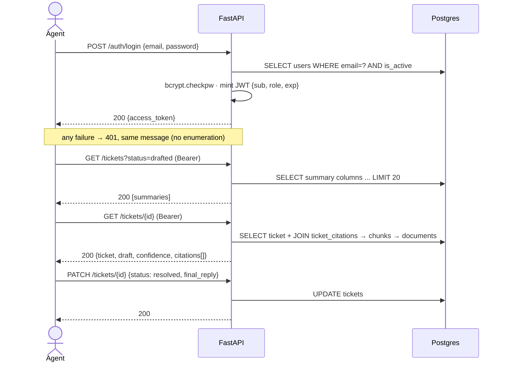
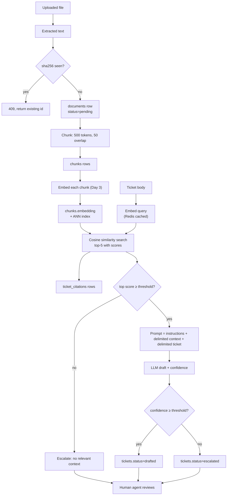

# Architecture — AI Support Triage API

**Status:** Day 1 design. Updated as the build progresses.
**Last updated:** 13 Sep 2026

---

## 1. What this system is and is not

A FastAPI backend that ingests support documentation and, for each incoming
customer ticket: classifies it, retrieves relevant passages by vector search,
drafts a grounded reply with citations, scores its own confidence, and escalates
to a human when confidence is low.

**Boundary:** the system never contacts a customer. Every output is a draft that
a human support agent reviews. This is a triage-and-draft tool with a human in
the loop, and most of the failure-mode decisions below depend on that boundary.

---

## 2. System architecture

| Component | Role | Failure impact |
|---|---|---|
| FastAPI | HTTP layer, validation, auth, dependency injection | Total outage |
| Postgres + pgvector | Users, documents, chunks, tickets, citations, embeddings | Total outage — let it 500 |
| Redis | Cache for query embeddings and responses | Slower, not down |
| Groq | Classification, drafting, confidence scoring | Tickets escalate to humans |
| Background tasks | Document ingestion, ticket processing | Stale `processing` rows; reprocess endpoint |

**Layering:** `api` (HTTP in/out, no business logic) → `services` (business
logic, no HTTP awareness) → `db` / `models` (persistence). The LLM provider is
called only from services, behind an interface, so tests can replace it with a
fake via `app.dependency_overrides`.

---

## 3. Roles

Three kinds of people. Two of them have accounts.

| Role | Has account | Can do |
|---|---|---|
| Customer | No | Submit a ticket, get a ticket ID |
| Agent | Yes (`role='agent'`) | List tickets, read drafts and citations, resolve tickets |
| Admin | Yes (`role='admin'`) | Everything an agent can, plus upload documents |

**Authentication** (who are you) is one endpoint, `POST /auth/login`, identical
for agents and admins. **Authorisation** (may you do this) is checked per
endpoint against `role`.

The word "agent" also refers to the LangGraph pipeline. That is code, not a
user, and has no row in any table.

Why customers don't log in: support forms are public everywhere; forcing signup
to report a problem is bad product. This makes `POST /tickets` an unauthenticated
internet-facing endpoint accepting free text — which is exactly why it gets rate
limiting and prompt-injection defence (Day 12).

Why upload is admin-only: documents become the retrieval corpus. Whoever can
upload can change what the AI says to every future customer.

---

## 4. Data model

### 4.1 Entity relationships

### 4.2 Tables

**`users`** — support staff only. Customers are never in this table.

| column | type | constraints / notes |
|---|---|---|
| `id` | `UUID` | PK, default `gen_random_uuid()` |
| `email` | `VARCHAR(320)` | unique, not null, lowercased (320 = RFC 5321 max) |
| `hashed_password` | `VARCHAR(255)` | bcrypt output |
| `role` | `VARCHAR(20)` | not null, default `agent`, CHECK in (`agent`, `admin`) |
| `is_active` | `BOOLEAN` | not null, default true. Deactivate, never delete — tickets and documents reference users |
| `created_at`, `updated_at` | `TIMESTAMPTZ` | not null, server default `now()` |

**`documents`** — one uploaded support document. The row exists before ingestion finishes.

| column | type | constraints / notes |
|---|---|---|
| `id` | `UUID` | PK |
| `title` | `VARCHAR(255)` | not null |
| `source_filename` | `VARCHAR(255)` | |
| `content_sha256` | `CHAR(64)` | unique — hash of extracted text, not file bytes |
| `raw_text` | `TEXT` | not null. Kept so Day 7 can re-chunk without re-upload |
| `status` | `VARCHAR(20)` | `pending` → `processing` → `ready` / `failed` |
| `error_message` | `TEXT` | nullable, set on `failed` |
| `chunk_count` | `INTEGER` | not null, default 0 |
| `uploaded_by_id` | `UUID` | FK → `users.id`, not null, `ON DELETE RESTRICT` |
| `created_at`, `updated_at` | `TIMESTAMPTZ` | |

**`chunks`** — ~500-token slice of a document, 50-token overlap.

| column | type | constraints / notes |
|---|---|---|
| `id` | `UUID` | PK |
| `document_id` | `UUID` | FK → `documents.id`, not null, `ON DELETE CASCADE` |
| `chunk_index` | `INTEGER` | not null, 0-based. `UNIQUE (document_id, chunk_index)` |
| `content` | `TEXT` | not null |
| `token_count` | `INTEGER` | not null |
| `embedding` | `vector(N)` | **Day 3.** Added with pgvector migration + index |
| `created_at` | `TIMESTAMPTZ` | |

**`tickets`** — a customer submission. Created on POST, before any AI runs; AI fields are nullable for that reason.

| column | type | constraints / notes |
|---|---|---|
| `id` | `UUID` | PK, doubles as the customer's reference |
| `customer_email` | `VARCHAR(320)` | not null |
| `subject` | `VARCHAR(500)` | nullable |
| `body` | `TEXT` | not null, length-limited at validation |
| `status` | `VARCHAR(20)` | `received` → `processing` → `drafted` / `escalated` / `failed` → `resolved` |
| `category` | `VARCHAR(50)` | nullable, set by classification (Day 4) |
| `draft_reply` | `TEXT` | nullable |
| `confidence` | `REAL` | nullable, 0.0–1.0 |
| `escalation_reason` | `TEXT` | nullable, free text (low similarity, LLM unavailable, …) |
| `assigned_agent_id` | `UUID` | FK → `users.id`, nullable, `ON DELETE SET NULL` |
| `created_at`, `updated_at` | `TIMESTAMPTZ` | |
| `processed_at` | `TIMESTAMPTZ` | nullable. `processed_at - created_at` = end-to-end latency |

There is deliberately no `sent_at`. The schema states the product boundary.

**`ticket_citations`** — which chunks were retrieved for which ticket, with scores. The audit trail and the input to Day 6 evals.

| column | type | constraints / notes |
|---|---|---|
| `ticket_id` | `UUID` | PK part, FK → `tickets.id`, `ON DELETE CASCADE` |
| `chunk_id` | `UUID` | PK part, FK → `chunks.id`, `ON DELETE CASCADE` |
| `rank` | `INTEGER` | 1 = best match |
| `score` | `REAL` | similarity at retrieval time |
| `used_in_reply` | `BOOLEAN` | default false |

### 4.3 `ON DELETE` rules

| FK | rule | reason |
|---|---|---|
| `chunks.document_id` | CASCADE | A chunk cannot exist without its document |
| `ticket_citations.*` | CASCADE | A citation cannot exist without both sides |
| `documents.uploaded_by_id` | RESTRICT | Documents outlive the person who uploaded them |
| `tickets.assigned_agent_id` | SET NULL | Tickets outlive the agent; they become unassigned |

Rule: CASCADE only when the child is meaningless without the parent.

---

## 5. Request flows

### 5.1 Flow A — admin uploads a document

Key points:
- `202` not `201`: the document exists but is not yet usable.
- Commit happens **before** the task is scheduled; the task opens its **own** DB session.
- Admin polls `GET /documents/{id}` for `status`.

### 5.2 Flow B — customer submits a ticket

Key points:
- The ticket row is persisted **before** any AI runs. An LLM outage cannot lose a ticket.
- Citations are written **before** drafting. An LLM failure still leaves a record of what retrieval found.
- `processed_at - created_at` gives per-ticket latency without code changes.

### 5.3 Flow C — agent reviews a draft

### 5.4 Endpoint authorisation matrix

| endpoint | public | agent | admin |
|---|---|---|---|
| `GET /health` | ✓ | ✓ | ✓ |
| `POST /tickets` | ✓ | ✓ | ✓ |
| `POST /auth/register`, `POST /auth/login` | ✓ | ✓ | ✓ |
| `GET /tickets`, `GET /tickets/{id}`, `PATCH /tickets/{id}` | | ✓ | ✓ |
| `POST /documents`, `GET /documents/{id}`, `POST /documents/{id}/reprocess` | | | ✓ |

---

## 6. Data flow — from file to draft

`chunks` is the hinge. Ingestion exists to fill it; retrieval exists to search it.

---

## 7. Failure modes and decisions

| # | Failure | State left behind | Decision |
|---|---|---|---|
| 1 | Background task dies mid-run (restart, OOM) | Row stuck at `processing` | Accept; surface stale-row count in `/metrics`; admin `reprocess` endpoint. No Celery. |
| 2 | LLM down / rate-limited | — | Retry 2× with backoff (1s, 4s) on 429/5xx only. Then `escalated`, `escalation_reason='llm_unavailable'`. Ticket never lost. |
| 3 | Retrieval finds nothing relevant | Top-5 returned with low scores | Similarity threshold → escalate before calling LLM. Grounding prompt + confidence check as backup. Threshold tuned from Day 6 evals, not guessed. |
| 4 | Same document uploaded twice | Duplicate chunks would pollute top-k | `content_sha256` unique on extracted text → `409`. |
| 5 | Postgres unreachable | — | Let it 500. `pool_pre_ping=True` for Neon idle timeouts. `/health` reports DB separately. |
| 6 | Prompt injection via ticket body | Bad draft | Delimited, labelled untrusted input; length limits; **human review is the real control**. Full mitigation Day 12. |
| 7 | Redis down | — | Non-fatal. try/except around cache ops, log, continue. A cache is an optimisation, never a dependency. |

Three principles underneath these:
1. **Persist the input before doing anything that can fail.**
2. **Degrade to the human.** Every failure path ends with a person looking at it.
3. **Make stuck states visible** rather than building recovery that can't be maintained.

---

## 8. Design decisions and alternatives

| Decision | Alternative considered | Why this one |
|---|---|---|
| UUID primary keys | Auto-increment integers | Ticket IDs are public. Sequential IDs leak volume and allow enumeration. UUIDv7 if index fragmentation ever matters. |
| `VARCHAR` + CHECK for enums | Postgres native `ENUM` | `ALTER TYPE` is painful inside Alembic transactions; removing values is near-impossible. Statuses will change on Days 4 and 10. Type safety lives in Python `StrEnum` + Pydantic. |
| `TIMESTAMPTZ` everywhere | `TIMESTAMP` | Absolute instants, comparable across servers. UTC internally, convert at the edge. |
| Nullable AI columns on `tickets` | Separate `drafts` table | No need for multiple drafts per ticket or separate access control. Split later if Day 10 retry history needs it — additive migration. |
| `is_active` flag | Deleting users | Users are referenced by documents and tickets. History must survive staff turnover. |
| No soft deletes elsewhere | `deleted_at` columns | Every query needs the filter; the first forgotten one leaks data. |
| `raw_text` stored in Postgres | File on disk / object storage | Re-chunking on Day 7 needs the original. At scale this moves to S3 with a pointer. |
| pgvector | Pinecone / Weaviate / Chroma | One database, one transaction boundary, one backup. Vector search joined to relational data in a single query. Managed vector DBs earn their cost at millions of vectors, not thousands. |
| FastAPI `BackgroundTasks` | Celery / RQ | In-process, not durable, no retries — stated honestly. Swapping to a queue changes only what invokes the ingestion function. |
| JWT | Server-side sessions | Stateless; no session store to scale; matches what agents' tooling expects. Tradeoff: cannot revoke before expiry without a blocklist. |
| bcrypt | SHA-256 | Deliberately slow, salted, tunable work factor. Fast hashes are a brute-force gift. |
| Redis for cache only | Redis as queue/broker | Keeps the cache non-critical. Losing Redis slows things; it doesn't break them. |

---

## 9. Deferred (on purpose)

- `chunks.embedding` + pgvector extension + ANN index — Day 3
- Embedding provider (Groq has no embeddings endpoint) — Day 3
- Redis caching, streaming — Day 4
- Rate limiting, prompt-injection mitigation, PII redaction — Day 12
- Hybrid search, re-ranking — Day 8
- Reflection / retry loop — Day 10
- `/metrics`, tracing, cost per ticket — Day 11
- Durable task queue — out of scope; documented as the next step at scale

---

## 10. What this project does not claim

No Celery, no Kubernetes, no managed vector database, no fine-tuning, no
production scale. See the plan document for the full list.
